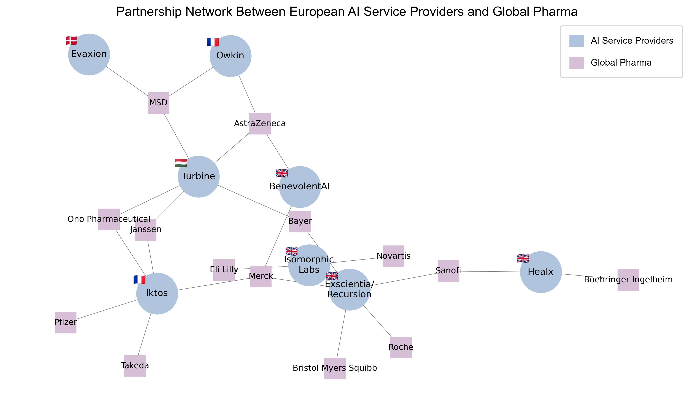

### MBA Consulting Project | Visualizing partnerships between AI drug discovery companies and global pharmaceutical firms

## Business Context
During my MBA consulting project with **ExaFlux**, I explored the landscape of AI-driven drug discovery companies and their collaborations with global pharmaceutical firms.

To better understand the ecosystem, I mapped publicly reported partnerships between European AI companies and global pharma companies using a network visualization. This provides a clearer view of how collaborations are structured across the industry.

## Partnership Network


*Figure: Network visualization of partnerships between European AI service providers and global pharmaceutical companies.*

## Key Contributions
- **Data Collection & Validation**  
  Compiled partnership data from publicly available sources including company websites, press releases, and industry reports.

- **Network Visualization**  
  Used Python (`NetworkX`, `Matplotlib`) to map relationships between AI companies and pharmaceutical partners.

- **Ecosystem Insight**  
  The visualization highlights collaboration patterns and helps identify pharmaceutical companies with relatively limited exposure to AI partnerships.

## Tech Stack
- Python (`NetworkX`, `Matplotlib`)
- Data research and validation
- AI-assisted development (ChatGPT)

## What This Project Demonstrates

- Turning a spreadsheet of partnership information into a visual map that makes relationships easier to understand  
- Using Python to visualize how AI drug discovery companies connect with global pharmaceutical firms  
- Showing how network visualization can reveal collaboration patterns that are difficult to see in a table

In our project discussions, partnerships were initially reviewed in spreadsheet format, which made it difficult to see the broader relationship patterns.  
Once visualized as a network, it became clearer how certain AI companies connected to multiple pharmaceutical partners.  
This perspective helped shift the conversation toward exploring go-to-market opportunities starting from AI companies rather than targeting pharmaceutical firms directly.

## Project Structure

```
AI-Pharma-Network-Analysis
│
├── AI_Pharma_Partnership_Network.ipynb
├── AI_Pharma_Partnership_Data.xlsx
├── network_visualization.png
├── README.md
│
├── gb.png   (UK)
├── mf.png   (France)
├── hu.png   (Hungary)
└── dk.png   (Denmark)
```

## Note on Data
Partnership data was compiled from publicly available sources such as company announcements and press releases. The visualization provides an illustrative overview of the ecosystem rather than a complete record of all partnerships.
